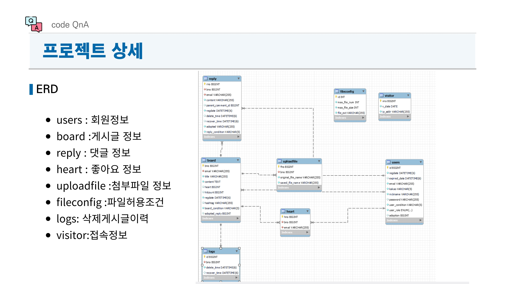
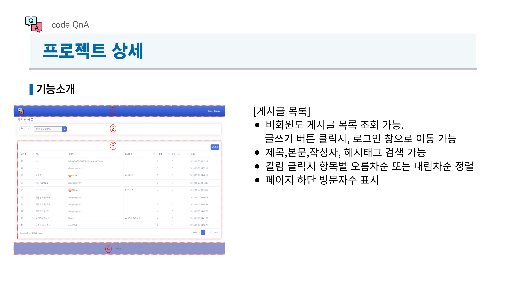
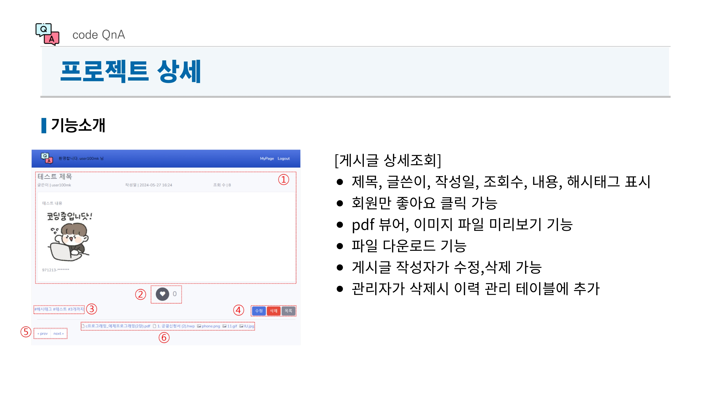
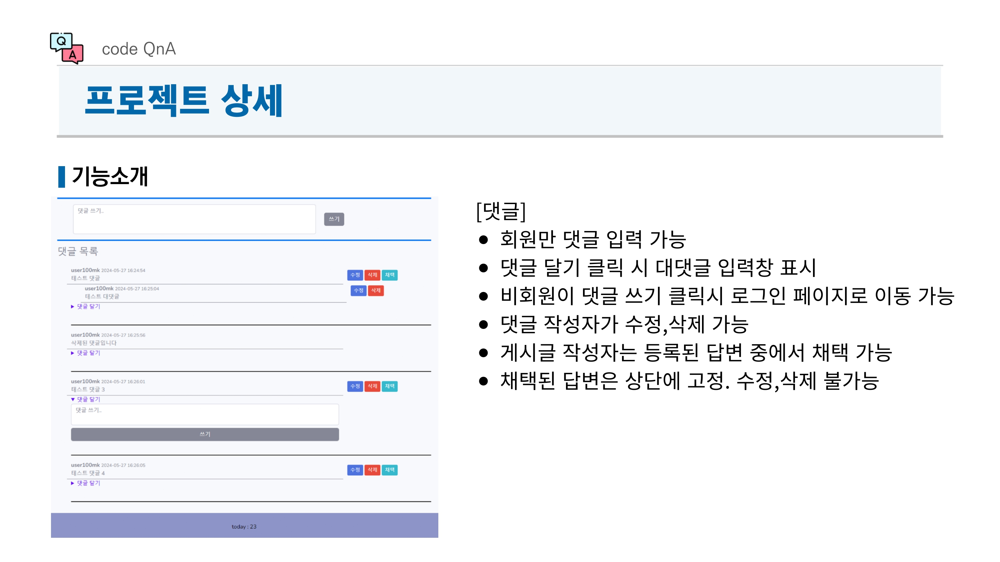
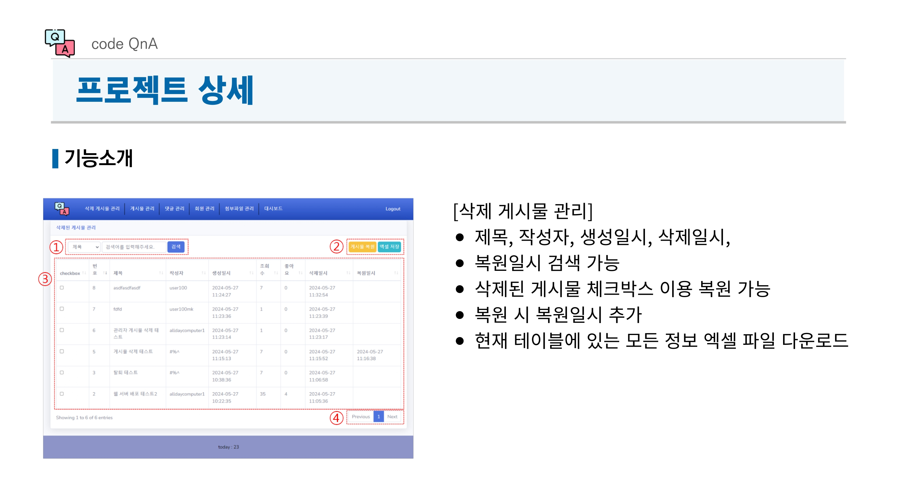
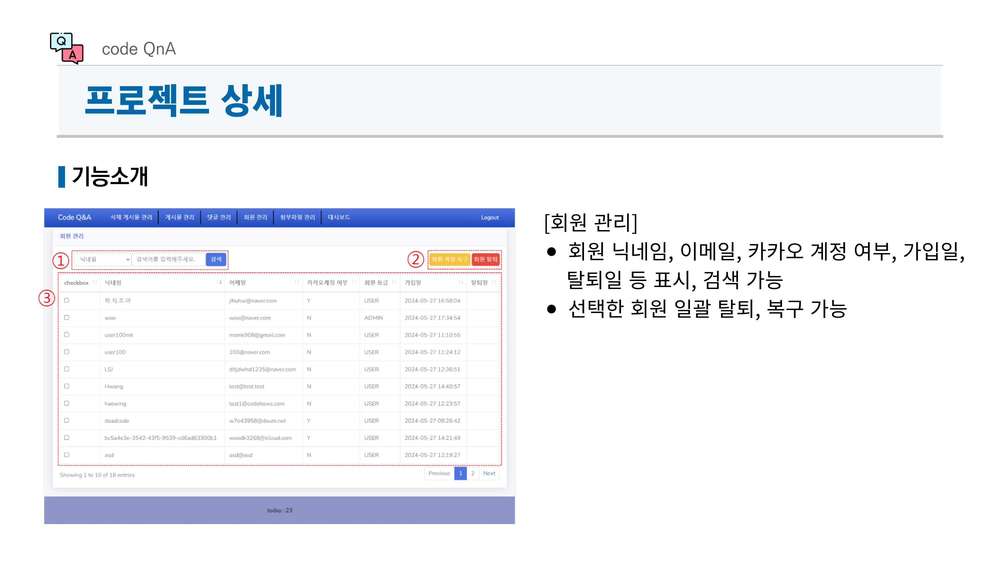
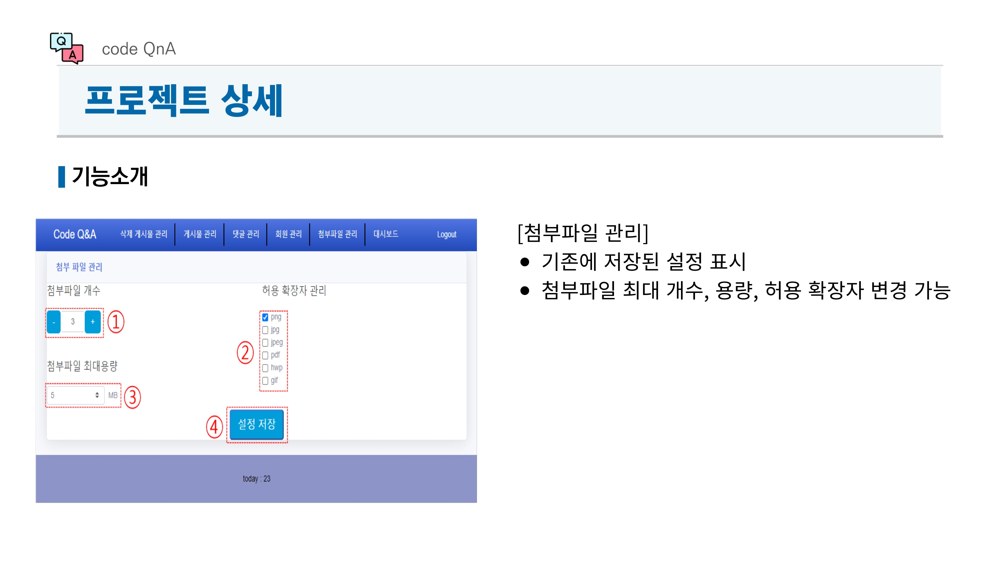
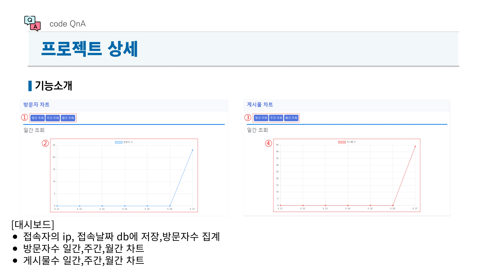

---

# ❓ Code QnA - Q&A 게시판 프로젝트

## 📌 프로젝트 개요

Code QnA는 **코드하우스 교육생들 간의 원활한 질문과 답변을 위한 Q&A 게시판**입니다.  
커뮤니티 내 의사소통을 활성화하고, 질문과 응답을 통해 개인과 전체 커뮤니티의 성장을 도모하는 것을 목표로 합니다.

---

## 🎯 기획 의도

**Insight:**  
효율적인 질의응답 시스템을 구축하여 개발자 커뮤니티의 원활한 지식 공유를 돕는 플랫폼입니다.

### **핵심 기능**

- **Keyword 1:** Q&A 게시판 (질문 작성, 답변 채택)
- **Keyword 2:** 비회원도 질문 조회 가능
- **Keyword 3:** 파일 첨부 및 미리보기 기능

---

## 📌 프로젝트 소개

### **주요 기능**

✅ **게시글 관리:** 질문 작성, 수정, 삭제, 해시태그 추가  
✅ **댓글 시스템:** 댓글/대댓글 작성 및 삭제  
✅ **답변 채택 기능:** 작성자가 가장 적절한 답변을 채택 가능  
✅ **파일 업로드:** 이미지 및 PDF 미리보기 지원  
✅ **관리자 기능:** 게시물 및 댓글 삭제/복원, 회원 탈퇴 및 복구  
✅ **통계 시스템:** 방문자 수 및 게시글 수 차트 제공

---

## 🛠 개발 환경

| 프로그래밍 언어 | 백엔드 프레임워크   | 프론트엔드                            | 데이터베이스                 |
| -------- | ----------- | -------------------------------- | ---------------------- |
| Java     | Spring Boot | Thymeleaf, HTML, CSS, JavaScript | MySQL, JPA (Hibernate) |


---

## 🏗 시스템 구조도

Code QnA는 다음과 같은 구조로 설계되었습니다.

```plaintext
메인 화면
│
├── 게시판
│   ├── 질문 목록 조회
│   ├── 게시글 작성/수정/삭제
│   ├── 해시태그 검색
│
├── 댓글 시스템
│   ├── 댓글/대댓글 작성 및 삭제
│   ├── 답변 채택 기능
│
├── 파일 업로드
│   ├── 이미지 및 PDF 미리보기
│   ├── 파일 다운로드 지원
│
├── 관리자 기능
│   ├── 게시글/댓글 삭제 및 복원
│   ├── 회원 관리 (탈퇴 및 복구)
│
└── 대시보드
    ├── 방문자 통계
    ├── 게시글 등록 현황 분석
```

---

## 📂 ERD (Entity Relationship Diagram)

Code QnA의 데이터베이스 구조는 다음과 같이 설계되었습니다.



---

## 🎨 UI 화면 구성

### **📝 게시글 목록 및 작성**

 
 
 

---

### **💬 댓글 및 답변 채택**

 

---

### **👥 관리자 기능**





---
### **📊 대시보드 (방문자 및 게시글 통계)**

 

---
